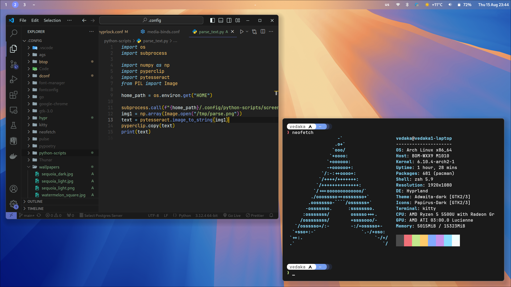

## Requirements
### Arch (pacman)
```bash
qt5-wayland 
qt5ct
qt6-wayland 
qt6ct
qt5-svg
qt5-quickcontrols2
qt5-graphicaleffects
ttf-nerd-fonts-symbols
hypridle
hyprland
hyprlock
thunar
gtk3
cairo
gtk-layer-shell
libgirepository
gobject-introspection
gobject-introspection-runtime
python
python-pip
python-gobject
python-cairo
python-loguru
pkgconf
pipewire
pavucontrol
pipewire-pulse
pipewire-audio
pipewire-jack
bluez 
bluez-utils 
polkit-gnome 
gnome-bluetooth-3.0 
gnome-calculator
gnome-control-center
nwg-look
blueberry
wireplumber
cliphist
kitty 
wl-clipboard 
python-requests
python-pytesseract
python-pillow
python-numpy
python-pyperclip
python-setproctitle
swww
wofi
swappy
grim
slurp
brightnessctl 
network-manager-applet
starship 
papirus-icon-theme
ttf-jetbrains-mono-nerd 
xfce4-settings
sddm
```

### Arch (AUR)
```bash
wlogout
matugen-bin
python-fabric-git
python-pygobject-stubs
ttf-tabler-icons
```


    

